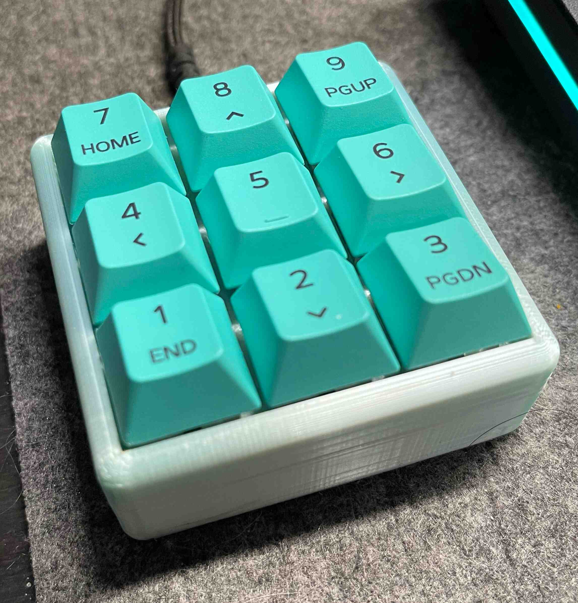
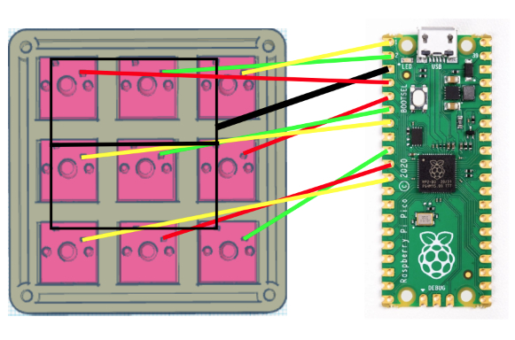
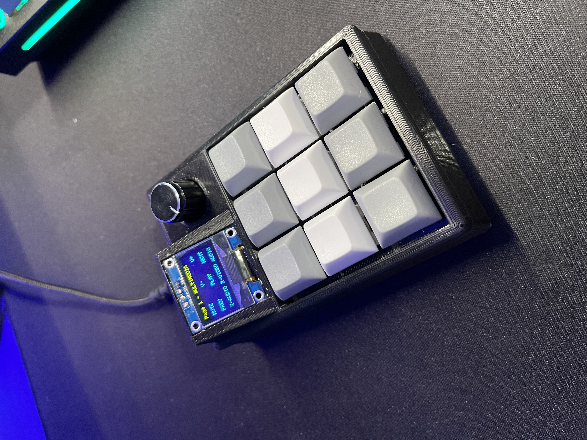

# pico-macro-pad
Make a macro-pad using a Raspberry pi pico and circuit python


# 3x3

___

## 1. Wiring Diagram


## [2. STL via thingiverse](https://www.thingiverse.com/thing:4816077)

## 3. Code
1. download circuitPython [here](https://circuitpython.org/board/raspberry_pi_pico/)
2. follow instructions to install circuit python onto your Raspberry pi pico
3. clone repo - `git clone https://github.com/jaysongiroux/pico-macro-pad.git`
4. copy main.py, boot.py and lib/ onto your pico
5. reboot

## Macros
`main.py` can be edited to use different macros, supporting strings, key combinations and media control keys

```
# String:
(8): (STRING, ["git add .", NEW_LINE]),  # 7

# Media:
(5): (MEDIA, [ConsumerControlCode.SCAN_PREVIOUS_TRACK])

# Key combination:
(0): (KEY, [Keycode.LEFT_CONTROL, Keycode.C]),  # 1
```

# 3x3 With Screen and EC11 Rotary Encoder
Make a macropad that supports multiple pages of macros along with the support of multiple OSs and a display to show each key's mapping



___

## Purchase Electronics
- [Rubber Feet](https://www.amazon.com/dp/B06XCLYL53?psc=1&ref=ppx_yo2ov_dt_b_product_details)
- [EC11 Rotary Encoder](https://www.amazon.com/dp/B08728K3YB?psc=1&ref=ppx_yo2ov_dt_b_product_details)
- [Raspberry pi Pico](https://www.amazon.com/dp/B093PJ2NJZ?psc=1&ref=ppx_yo2ov_dt_b_product_details)
- [128x64 oled ssd1306 yellow/blue screen](https://www.amazon.com/dp/B072Q2X2LL?psc=1&ref=ppx_yo2ov_dt_b_product_details)
- [Key Caps](https://www.amazon.com/dp/B09MVHJY5K?psc=1&ref=ppx_yo2ov_dt_b_product_details)
- Pick your own Cherry MX style mechanical keyboard switches

## Download
- [Circuit python mu editor](https://codewith.mu/en/download)
- [Thingiverse STL](https://www.thingiverse.com/thing:5367540)

## Wiring
### Switches
wire switched to:
- GP2
- GP3
- GP4
- GP5
- GP6
- GP7
- GP8
- GP9
- GP10
- GROUND

### Display
- SCL: GP1
- SDA: GP0
- POWER/GROUND

### Encoder
- GP18
- GP19
- Button is not used in this iteration however wire it to GP11 if you choose to use the button. 
- GROUND

## Setup
Copy the contents of the 3x3_with_screen_and_ec11 folder into the circuitPython Directory. This directory will show up when you connect your Raspberry pi Pico with circuit python firmware installed. 

All external libraries and files have been included, this should be as simple as dragging and dropping the contents into the pico.

### Notes:
- Screens can be added/ removed at the top of the code.py file
- Manual spacing is involved to get a neat looking 3x3 layout on the screen. this spacing will be needed in the `page_X_format` variable
- Similar to the plain 3x3 macro pad, strings, multi-media and key macros are all supported.
- support MacOS (intel and apple) along with windows OS's
- An Example apple script has been added to the "extras" directory to demonstrate how to link a keyboard shortcut to a service using automaton